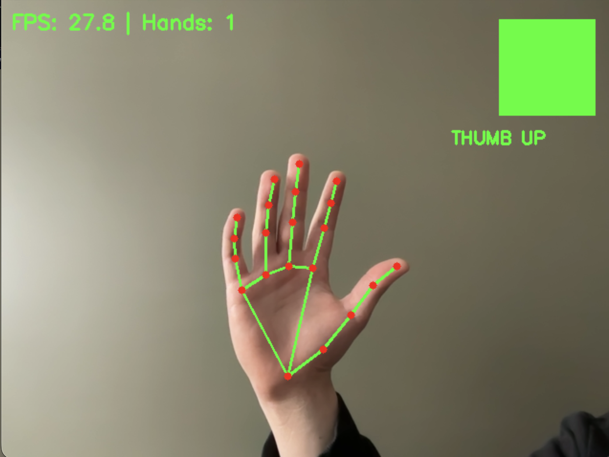
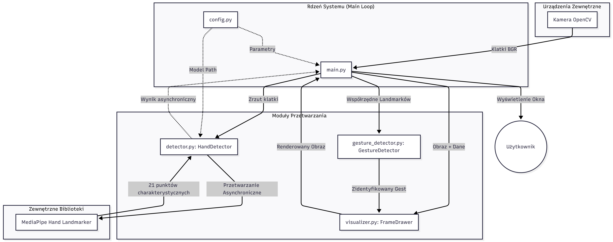
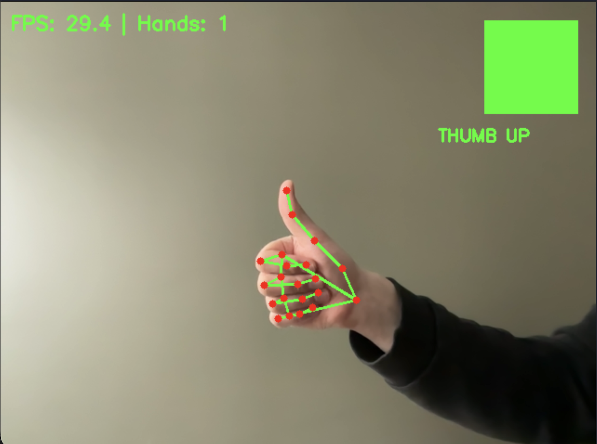
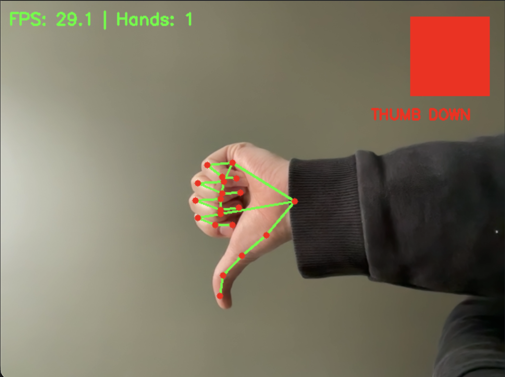
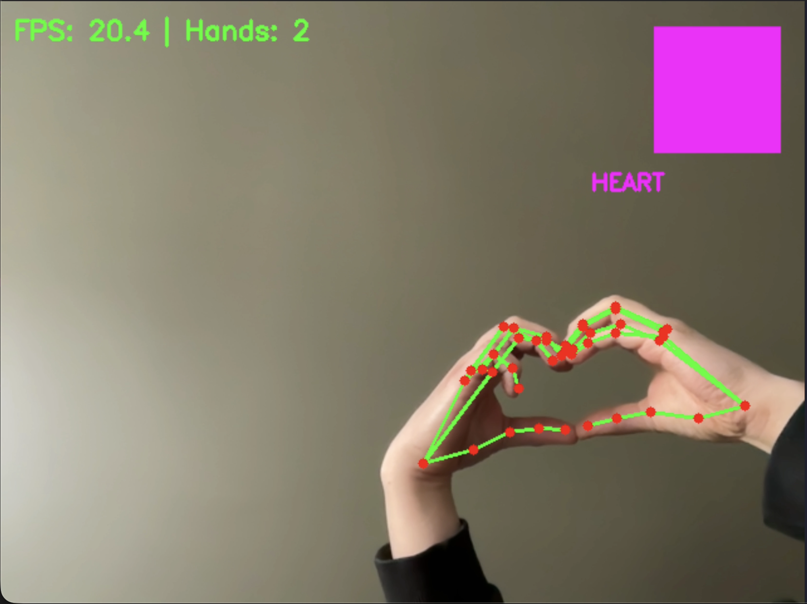

# System Rozpoznawania Gestów Dłoni w Czasie Rzeczywistym

### Zespół nr 7
**Skład zespołu:**
* Jakub Płowiec (gr. 3)
* Adrian Żerebiec (gr. 3)
* Michał Skałka (gr. 3)
* Jakub Barber (gr. 1)
* Radosław Kawa (gr. 1)
* Filip Dziurdzia (gr. 4)

**Kod źródłowy projektu:** [https://github.com/BARBUR02/hand_gestures_recognition](https://github.com/BARBUR02/hand_gestures_recognition)

---

## 1. Wstęp

Celem projektu było zaprojektowanie i zaimplementowanie systemu wizyjnego (szybkiego, niezawodnego, zajmującego jak najmniej czasu procesora) działającego w czasie rzeczywistym, służącego do detekcji dłoni oraz rozpoznawania gestów użytkownika. Aplikacja wykorzystuje kamerę internetową do akwizycji obrazu, a następnie przetwarza go przy użyciu algorytmów uczenia maszynowego (MediaPipe) oraz komputerowego przetwarzania obrazu (OpenCV).

System został zaprojektowany jako interaktywny interfejs (HCI - Human-Computer Interaction), który nie tylko śledzi ruch dłoni, ale również interpretuje ich układ jako konkretne komendy semantyczne (np. „OK”, „Pokój”, „Serce”).

## 2. Przegląd literatury

W ramach przygotowania teoretycznego przeanalizowano następujące pozycje literaturowe dotyczące tematyki rozpoznawania gestów (HGR - Hand Gesture Recognition):

1.  **Mohamed, A. S., Hassan, N. F., Jamil, A. S. (2024). *Real-Time Hand Gesture Recognition: A Comprehensive Review of Techniques, Applications, and Challenges*.**
    Praca ta stanowi przegląd ewolucji metod HGR, od prostych algorytmów bazujących na kolorze skóry po zaawansowane głębokie sieci neuronowe. Autorzy wskazują na kluczowe wyzwania, takie jak zmienne oświetlenie i tło, oraz omawiają zastosowania w medycynie i systemach bezpieczeństwa. Wnioski z tej pracy posłużyły do wyboru metod detekcji punktów kluczowych zamiast prostej segmentacji obrazu.

2.  **Zhang, F., et al. (2020). *MediaPipe Hands: On-device Real-time Hand Tracking*.**
    Publikacja techniczna opisująca architekturę rozwiązania MediaPipe Hands. System opiera się na potoku przetwarzania, który najpierw lokalizuje dłoń (Palm Detector), a następnie estymuje 21 punktów charakterystycznych (Hand Landmarks) w przestrzeni 2.5D. Kluczowym atutem tego rozwiązania, wykorzystanym w naszym projekcie, jest wysoka wydajność na procesorach CPU, co umożliwia działanie bez dedykowanej karty graficznej.

3.  **Naoum, A. (2024). *Real-Time Hand Tracking and Gesture Recognition with MediaPipe: Rerun Showcase*.**
    Artykuł prezentuje praktyczne aspekty łączenia danych z MediaPipe z narzędziami do wizualizacji. Skupia się na interpretacji surowych współrzędnych (x, y, z) punktów dłoni w celu budowania intuicyjnych interfejsów sterowanych gestami.

## 3. Technologie i Narzędzia

W projekcie wykorzystano następujący stos technologiczny:

* **Język programowania:** Python 3.13
* **MediaPipe:** Biblioteka Google wykorzystana do ekstrakcji 21 punktów charakterystycznych (landmarków) dłoni. Wykorzystano model `hand_landmarker.task` w wersji float16
* **OpenCV (cv2):** Biblioteka do obsługi strumienia wideo z kamery, manipulacji ramkami obrazu oraz rysowania interfejsu (wizualizacja szkieletu, tekstu)
* **NumPy:** Obliczenia numeryczne i operacje na macierzach obrazu
* **uv:** Manager pakietów i środowiska wirtualnego w Pythonie napisany w Rustcie
* **Task (Taskfile):** Narzędzie do automatyzacji zadań projektowych, w tym automatycznego pobierania modelu ML przed pierwszym uruchomieniem aplikacji

## 4. Architektura i Implementacja Systemu

System został zaprojektowany w sposób modułowy, co ułatwia jego rozwój i testowanie. Kod podzielono na pięć głównych komponentów:

### 4.1. Konfiguracja (`config.py`)
Klasa `AppConfig` przetrzymuje parametry konfiguracyjne aplikacji. Do generowania wyników do sprawozdania wykorzystano następujące ustawienia:
* Ścieżka do modelu: `models/hand_landmarker.task`.
* Maksymalna liczba dłoni: 2.
* Rozdzielczość kamery: 640x480.
* Interwał detekcji: 50 ms (asynchroniczne wywoływanie modelu co 50ms pozwala na utrzymanie wysokiego FPS, unikając blokowania wątku głównego przy każdej klatce).

### 4.2. Moduł Detekcji (`detector.py`)
Klasa `HandDetector` odpowiada za komunikację z biblioteką MediaPipe. Kluczowym elementem implementacji jest wykorzystanie trybu `LIVE_STREAM` oraz metody `detect_async`. Dzięki zastosowaniu mechanizmu *callback* oraz blokady wątku (`threading.Lock`), wyniki detekcji są aktualizowane w tle, a główna pętla programu pobiera zawsze najświeższy dostępny wynik bez oczekiwania na zakończenie inferencji sieci neuronowej.

    

### 4.3. Moduł Analizy Gestów (`gesture_detector.py`)
Autorska implementacja logiki rozpoznawania gestów oparta na geometrii euklidesowej punktów dłoni.
Analiza odbywa się na dwóch poziomach:

**A. Gesty jednoręczne:**
Algorytm analizuje stan wyprostowania palców, porównując odległość czubka palca od nadgarstka z odległością stawu środkowego od nadgarstka.
* **Kciuk w górę/dół:** Porównanie współrzędnej Y czubka kciuka i jego podstawy
* **Otwarta dłoń (Palm):** Wszystkie palce wyprostowane
* **Pięść (Fist):** Wszystkie palce zgięte
* **Znak Pokoju (Peace):** Wyprostowany palec wskazujący i środkowy, reszta zgięta
* **OK:** Zbliżenie czubka kciuka i palca wskazującego (dystans < 0.05), pozostałe palce wyprostowane

**B. Gesty dwuręczne (Globalne):**
* **Serce:** Wymaga wykrycia dwóch dłoni. Algorytm sprawdza trzy warunki jednocześnie:
    1.  Dystans między kciukami obu dłoni < 0.12.
    2.  Dystans między palcami wskazującymi obu dłoni < 0.12.
    3.  Palce wskazujące i kciuki są od siebie oddalone (tworząc łuki serca).

### 4.4. Wizualizacja (`visualizer.py`)
Klasa `FrameDrawer` rysuje szkielet dłoni (zielone linie połączeń, czerwone punkty stawów) oraz nakłada etykiety rozpoznanych gestów. Wyróżniono gesty kolorami (np. zielony dla "Thumb Up", czerwony dla "Thumb Down", fioletowy dla "Heart"). 

### 4.5. Główna Pętla Aplikacji (`main.py`)
Główna pętla (`main.py`) oblicza rzeczywistą liczbę klatek na sekundę (FPS) i steruje przepływem danych.

    

## 5. Testy i Wyniki

Testy funkcjonalne i wydajnościowe przprowadziliśmy na standardowym laptopie z wbudowaną kamerą internetową.

### 5.1. Wydajność
Dzięki zastosowaniu asynchronicznej detekcji (co 50ms) niezależnej od renderowania obrazu, system osiągnął stabilną płynność na poziomie **~30 FPS**. Opóźnienie między wykonaniem gestu a jego wykryciem jest niezauważalne dla użytkownika.

### 5.2. Skuteczność rozpoznawania
* **Gesty statyczne (Pięść, Dłoń):** Wykrywane z niemal 100% skutecznością.
* **Kciuk w górę/dół:** Wysoka skuteczność, zaimplementowany próg 0.05 skutecznie eliminuje drgania (false positives) w pozycji neutralnej.
* **Serce:** Najbardziej złożony gest. Wymaga precyzyjnego ustawienia dłoni naprzeciw kamery. System poprawnie ignoruje sytuacje, gdy dłonie są blisko siebie, ale nie tworzą kształtu serca (dzięki warunkowi "spread").

### 5.3. Wizualizacja
Poniżej przedstawiono przykłady działania systemu (zgodnie z dokumentacją wizualną projektu):
* Wizualizacja 21 punktów charakterystycznych na dłoniach.
* Etykieta tekstowa i kolorowy wskaźnik w prawym górnym rogu informujący o aktualnym stanie.
* Licznik FPS i licznik wykrytych dłoni.

  
  
  

## 6. Podsumowanie

W ramach projektu stworzyliśmy system działający w czasie rzeczywistym, który jest w stanie rozpoznać zarówno proste gesty (kciuk), jak i złożone interakcje dwuręczne (serce). Aby spełnić wymagania projektowe, zaimplementowaliśmy wydajną architekturę wielowątkową, która oddziela proces akwizycji obrazu od ciężkich obliczeń sieci neuronowej.

Kod jest modułowy i łatwo rozszerzalny o nowe gesty poprzez dodanie kolejnych warunków geometrycznych w klasie `GestureDetector`.

## 7. Bibliografia

1.  Mohamed, A. S., Hassan, N. F., Jamil, A. S. (2024). *Real-Time Hand Gesture Recognition: A Comprehensive Review of Techniques, Applications, and Challenges*.
2.  Zhang, F., Bazarevsky, V., Vakunov, A., Tkachenka, A., Sung, G., Chang, C., & Grundmann, M. (2020). *MediaPipe Hands: On-device Real-time Hand Tracking*.
3.  Naoum, A. (2024). *Real-Time Hand Tracking and Gesture Recognition with MediaPipe: Rerun Showcase*.
4.  Dokumentacja Google MediaPipe: [https://ai.google.dev/edge/mediapipe/solutions/vision/hand_landmarker](https://ai.google.dev/edge/mediapipe/solutions/vision/hand_landmarker)
5.  Pomocnicze materiały wideo:
    * *Sign Language Detection with Python and Scikit Learn* (YouTube): https://www.youtube.com/watch?v=doDUihpj6ro
    * *AI Hand Gesture Recognition using Python and MediaPipe* (YouTube): https://www.youtube.com/watch?v=a99p_fAr6e4